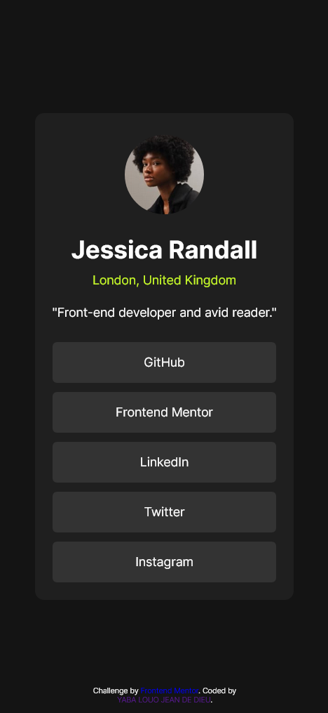
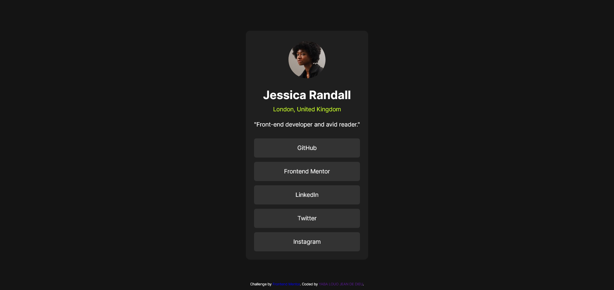

# Frontend Mentor - Social links profile solution

This is a solution to the [Social links profile challenge on Frontend Mentor](https://www.frontendmentor.io/challenges/social-links-profile-UG32l9m6dQ). Frontend Mentor challenges help you improve your coding skills by building realistic projects. 

## Table of contents

- [Overview](#overview)
  - [The challenge](#the-challenge)
  - [Screenshot](#screenshot)
  - [Links](#links)
- [My process](#my-process)
  - [Built with](#built-with)
  - [What I learned](#what-i-learned)
- [Author](#author)

## Overview

### The challenge

Users should be able to:

- See hover and focus states for all interactive elements on the page

### Screenshot




Add a screenshot of your solution. The easiest way to do this is to use Firefox to view your project, right-click the page and select "Take a Screenshot". You can choose either a full-height screenshot or a cropped one based on how long the page is. If it's very long, it might be best to crop it.

Alternatively, you can use a tool like [FireShot](https://getfireshot.com/) to take the screenshot. FireShot has a free option, so you don't need to purchase it. 

Then crop/optimize/edit your image however you like, add it to your project, and update the file path in the image above.

**Note: Delete this note and the paragraphs above when you add your screenshot. If you prefer not to add a screenshot, feel free to remove this entire section.**

### Links

- Solution URL: [Github Page](https://victoire20.github.io/socila-links-profile)
- Live Site URL: [Add live site URL here](https://your-live-site-url.com)

## My process

### Built with

- Semantic HTML5 markup
- CSS custom properties
- Flexbox
- Mobile-first workflow

### What I learned

I learned how to center content in the middle of the page while taking into account the positioning of other elements and overflow management.

To see how you can add code snippets, see below:

```html
<body>

  <main>
    <div class="card">
      <div class="card__header">      
        
        <div class="card__info">            
          <h1>Jessica Randall</h1>
          <p>London, United Kingdom</p>
        </div>
      </div>
      <div class="card__body">
        <p>"Front-end developer and avid reader."</p>

        <ul class="social__media">
          <li class="social__media__item">
            <a href="#">GitHub</a>
          </li>
          <li class="social__media__item">
            <a href="#">Frontend Mentor</a>
          </li>
          <li class="social__media__item">
            <a href="#">LinkedIn</a>
          </li>
          <li class="social__media__item">
            <a href="#">Twitter</a>
          </li>
          <li class="social__media__item">
            <a href="#">Instagram</a>
          </li>
        </ul>
      </div>
    </div>
  </main>
  
  <footer>
    <div class="attribution">
      Challenge by <a href="https://www.frontendmentor.io?ref=challenge" target="_blank">Frontend Mentor</a>. 
      Coded by <a href="https://github.com/victoire20">YABA LOUO JEAN DE DIEU</a>.
    </div>
  </footer>
</body>
```
```css
body {
    font-family: 'Inter';
    font-size: 14px;
    background: var(--gray-900);
    color: var(--white);    
    height: 100vh;
    display: flex;
    flex-direction: column;
    justify-content: center;
    align-items: center;
}

.card {
    background: var(--gray-800);
    width: 100%;
    max-width: 350px;
    padding: 20px;
    border-radius: 10px;
}

footer {
    font-size: .6em;
    position: fixed;
    bottom: 10px;
    left: 50%;
    transform: translateX(-50%);
    text-align: center;
}
```

## Author

- Website - [https://github.com/victoire20](https://github.com/victoire20)
- Frontend Mentor - [@victoire20](https://www.frontendmentor.io/profile/victoire20)
